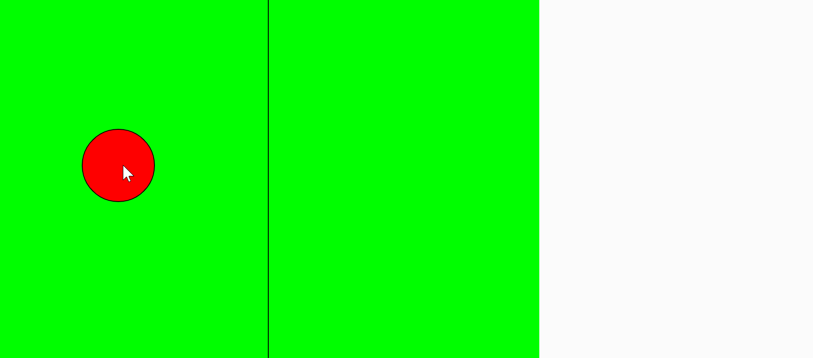

# Workshop - MS Ried

Bei diesem Workshop verwenden wir die ***JavaScript* Bibliothek *p5.js***:

- ***JavaScript*** ist eine Programmiersprache.
  - Mit Programmiersprachen kann man Apps, Websites, Spiele, ... entwickeln.
  - *JavaScript* ist im Internet auf fast jeder Website im Einsatz!
  
- Eine **Bibliothek** ist wie ein Werkzeugkasten für Programmierer:innen
  - ***p5.js*** enthält z. B. fertige Zeichenfunktionen für Rechtecke, Kreise, ...
  - Nähere Infos für das Zeichen am Computer findest du [hier](https://p5js.org/learn/coordinate-system-and-shapes.html).


Ein *p5.js* Programm besitzt **zwei wichtige Funktionen**:

- **`setup()`**
  
  - Wird nur einmal (beim Programmstart) ausgeführt.
  - Darin wird z.B. das Spielfeld erstellt.
- **`draw()`**
  
  - Wird 60x pro Sekunde ausgeführt.
  - Darin werden z.B. die Spielfiguren gezeichnet.


**Hier siehst du den Code eines *p5.js* Programms:**

```js
// Anweisungen in setup() werden nur einmal (beim Programmstart) ausgeführt
function setup() {
  createCanvas(600, 400);     // erstellt eine Zeichenfläche mit 600x400 Pixeln
}

// Anweisungen in draw() werden 60x pro Sekunde ausgeführt
function draw() {
  background(255, 0, 255);    // färbt den Hintergrund magenta ein
  line(0, 400, 600, 0);       // zeichnet eine Linie
    
  if (mouseIsPressed) {       // wenn die Maustaste gedrückt ist
    fill(0, 255, 0);          // wird die Füllfarbe auf grün gesetzt,
  } else {                    // sonst
    fill(255, 255, 255);      // wird die Füllfarbe auf weiß gesetzt
  }
    
  ellipse(mouseX, mouseY, 50, 50);   // zeichnet einen Kreis an die Position des Mauszeigers
}
```


**Und so sieht dieses Programm aus, wenn es ausgeführt wird:**


**Jetzt bist DU an der Reihe selbst zu programmieren:**

- Am Beginn jeder Challenge siehst du, wie dein Programm am Ende aussehen soll.
- Darunter findest du eine Step-By-Step-Anleitung mit (hoffentlich) hilfreichen Tipps.
- Falls du einmal nicht mehr weiterkommst, findest du am Ende jeder Challenge eine mögliche Lösung.
  - "Schummeln" ist aber natürlich nur im Notfall erlaubt! 😉
- Wenn du alle Aufgaben geschafft hast, wartet am Ende noch die **Super Challenge**.
  - Hier gibt es keine detaillierte Anleitung und auch keine Musterlösung.


## Challenge 1: Alien On Earth


1. Öffne den Web Editor auf https://editor.p5js.org/.

2. Kopiere folgendes Programm in den Editor.

   ```js
   function setup(){
     createCanvas(600, 400);
     rectMode(CENTER);
   }
   
   function draw(){
     // Hintergrund
     background(255, 255, 255);
       
     // Boden
     fill(255, 255, 255);
     rect(300, 360, 600, 80);
       
     // Körper
     fill(255, 255, 255);
     rect(300, 200, 40, 200);
       
     // Kopf
     fill(255, 255, 255);
     ellipse(300, 140, 120, 120);
       
     // Linkes Auge 
     fill(255, 255, 255);
     ellipse(262, 140, 32, 64);
       
     // Rechtes Auge
     fill(255, 255, 255);
     ellipse(338, 140, 32, 64);
       
     // Beine
     line(280, 300, 260, 320);
     line(320, 300, 340, 320);
   }
   ```

3. Färbe den Boden grün.

   - Verwende dafür `(0, 255, 0)` als RGB-Code des ersten `fill()`
   - RGB ist eine Abkürzung für Rot-Grün-Blau.

4. Färbe das linke Auge rot.

   - Verwende dafür `(255, 0, 0)` als RGB-Code des dazugehörigen `fill()`. 

5. Färbe das rechte Auge blau.

   - Überlege, wie du den RGB-Code des dazugehörigen `fill()` anpassen musst.

6. Färbe den Kopf gelb.

   - Überlege, wie du den RGB-Code des dazugehörigen `fill()` anpassen musst.
   - Tipp: Gelb ist eine Mischung aus Rot und Grün.

7. Färbe den Körper magenta.

   - Überlege, wie du den RGB-Code des dazugehörigen `fill()` anpassen musst.
   - Tipp: Auch Magenta ist eine Mischung aus zwei Grundfarben.

8. Ändere die Hintergrundfarbe auf hellblau.

   - Verändere dafür den RGB-Code von `background()`.

   - Den RGB-Code von Hellblau kannst du mit einem [Color Picker](https://g.co/kgs/GN5Bi2) herausfinden.

<details>
<summary>Lösung</summary>

```js
function setup(){
  createCanvas(600, 400);
  rectMode(CENTER);
}

function draw(){
  // Hintergrund
  background(66, 194, 245);
    
  // Boden
  fill(0, 255, 0);
  rect(300, 360, 600, 80);
    
  // Körper
  fill(255, 0, 255);
  rect(300, 200, 40, 200);
    
  // Kopf
  fill(255, 255, 0);
  ellipse(300, 140, 120, 120);
    
  // Linkes Auge
  fill(255, 0, 0);
  ellipse(262, 140, 32, 64);
    
  // Rechtes Auge
  fill(0, 0, 255);
  ellipse(338, 140, 32, 64);
    
  // Beine
  line(280, 300, 260, 320);
  line(320, 300, 340, 320);
}
```

</details>


## Challenge 2: Sand Worm


1. Öffne den Web Editor auf https://editor.p5js.org/.

   - Falls du den Editor noch von der letzten Challenge geöffnet hast: Lade die Website neu!
2. Verändere die Größe der Zeichenfläche.

   - Breite: 600 Pixel
   - Höhe: 400 Pixel
3. Färbe in `draw()` den Hintergrund orange ein.

   - Den RGB-Code kannst du mit einem [Color Picker](https://g.co/kgs/vGP3eQ) herausfinden.
   - RGB ist eine Abkürzung für Rot-Grün-Blau.
4. Zeichne in `draw()` einen Kreis in die Mitte der Zeichenfläche.

   -   Verwende: `ellipse(300, 300, 20, 20);`
5. Vergrößere den Durchmesser des Kreises auf 80 Pixel.
6. Setze in `draw()` die Füllfarbe auf grau.

   - Rufe dafür `fill()` mit dem passenden RGB-Code auf.
   - Tipp: Der Aufruf von `fill()` muss vor dem Aufruf von `ellipse()` stattfinden!
7. Verwende als x-Koordinate des Kreises die Position des Mauszeigers.

   - Auf die x-Koordinate des Mauszeigers kannst du über die Variable `mouseX` zugreifen.
   - Der Kreis sollte sich jetzt waagrecht mit deiner Maus bewegen.
8. Verwende auch für die y-Koordinate des Kreises die Position des Mauszeigers.

   - Wie könnte die passende Variable heißen?
9. Rufe `background()` in `setup()` statt in `draw()` auf.

   - Wie wirkt sich diese Änderung aus?


<details>
<summary>Lösung</summary>

```js
function setup() {
  createCanvas(600, 400);
  background(235, 159, 52);
}

function draw() {
  fill(170, 173, 170);
  ellipse(mouseX, mouseY, 80, 80);
}
```

</details>


## Challenge 3: Switch Colors



1. Öffne den Web Editor auf https://editor.p5js.org/.

2. Kopiere folgendes Programm in den Editor.

   ```js
   function setup() {
     createCanvas(600, 400);
   }
   
   function draw() {
     background(255, 255, 255);
     
     // Verzweigung
     
       
     line(300, 0, 300, 100);
     ellipse(mouseX, mouseY, 80, 80);
   }
   ```

3. Ändere den Aufruf von `line()`, so dass die senkrechte Linie bis nach unten reicht.

4. Füge folgenden Verzweigung in `draw()` ein. Welche Auswirkung hat diese Änderung?

   ```js
   function draw() {
     ...
     // Verzweigung
     if (mouseX < 300) { 
       fill(255, 0, 0);
     } else {
       fill(0, 255, 0);
     } 
     ...
   }
   ```

5. Ändere in der Verzweigung auch die Hintergrundfarbe.

   - Wenn der Mauszeiger in der linken Hälfte ist, soll der Hintergrund grün sein.
   - Sonst soll der Hintergrund rot sein.
   - Der Hintergrund ist also immer anders eingefärbt als der Kreis. 😉

<details>
<summary>Lösung</summary>

```js
function setup() {
  createCanvas(600, 400);
}

function draw() {
  // Verzweigung
  if (mouseX < 300) { 
    fill(255, 0, 0);
    background(0, 255, 0);
  } else {
    fill(0, 255, 0);
    background(255, 0, 0);
  } 
  
  line(300, 0, 300, 400);
  ellipse(mouseX, mouseY, 80, 80);
}
```

</details>


## Challenge 4: Falling Ball


1. Öffne den Web Editor auf https://editor.p5js.org/.

2. Kopiere folgendes Programm in den Editor.

   ```js
   let x = 300;
   let y = 0;
   
   function setup() {
     createCanvas(600, 400);
     fill(255, 255, 255);
   }
   
   function draw() {
     background(0, 0, 0);
   
     if (y > height) {
       
     }
   }
   ```

3. Zeichne in `draw()` mithilfe des folgenden Befehls einen Ball (=Kreis) an der Position `x` und `y`.

   - Verwende: `circle(x, y, 20);`

4. Erhöhe in `draw()` den Wert der `y`-Koordinate um 1. Der Ball sollte jetzt nach unten fallen.

   - Verwende: ` y = y + 1;`

5. Erhöhe die Geschwindigkeit des Balls, so dass er fünfmal so schnell nach unten fällt.

6. Füge in `draw()` die folgende Verzweigung ein.

   ```js
   if (y > height) {
   
   }
   ```

   - Die Variable `height` enthält die Höhe des Spielfelds.
   - So kannst du also prüfen, ob der Ball unten angekommen ist.

7. Setze, wenn der Ball am Boden auftrifft, die `y`-Koordinate auf `0` zurück.

   - Dadurch sollte ein neuer Ball von oben fallen.

8. Füge in der Verzweigung eine weitere Anweisung hinzu. 

   - Verwende: `x = random(600);`
   - Welche Auswirkung hat diese Änderung? 


<details>
<summary>Lösung</summary>

```js
let x = 300;
let y = 0;

function setup() {
  createCanvas(600, 400);
  fill(255, 255, 255);
}

function draw() {
  background(0, 0, 0);
  
  y = y + 5;
  circle(x, y, 20);

  if (y > height) {
    y = 0;  
    x = random(600);
  }
}
```

</details>


## Challenge 5: Catch the Ball


1. Öffne den Web Editor auf https://editor.p5js.org/.

2. Kopiere folgendes Programm in den Editor.

   ```js
   let x = 300;
   let y = 0;
   
   function setup() {
     createCanvas(600, 400);
     fill(255, 255, 255);
     rectMode(CENTER);
   }
   
   function draw() {
     background(0, 0, 0);
     
     y = y + 5;
     circle(x, y, 20);
   
     if (y > height) {
       y = 0;  
       x = random(600);
     }
   }
   ```

3. Zeichne in `draw()` einen Fangkorb (=Rechteck).

   - Verwende: `rect(100, 200, 40, 20); `


4. Verwende als x-Koordinate des Fangkorbs die Position des Mauszeigers.

5. Positioniere den Fangkorb am unteren Rand des Spielfelds.

   - Verwende für die Berechnung der y-Koordinate den Wert der Variable `height` (=Spielfeldhöhe).
   - Tipp: Du musst von `height` noch etwas abziehen.

<details>
<summary>Lösung</summary>

```js
let x = 300;
let y = 0;

function setup() {
  createCanvas(600, 400);
  fill(255, 255, 255);
  rectMode(CENTER);
}

function draw() {
  background(0, 0, 0);
  
  y = y + 5;
  circle(x, y, 20);

  if (y > height) {
    y = 0;  
    x = random(600);
  }
  
  rect(mouseX, height - 10, 40, 20);  
}
```

</details>


## Super Challenge: Jump Ball


1. Öffne den Web Editor auf https://editor.p5js.org/.

2. Kopiere folgendes Programm in den Editor.

   ```js
   let x = 300;
   let y = 0;
   let speed = 5;
   
   function setup() {
     createCanvas(600, 400);
     fill(255, 255, 255);
   }
   
   function draw() {
     background(0, 0, 0);
     
     y = y + speed;
     circle(x, y, 20);
   
     if (y > height) {
       y = 0;
     }
   }
   ```

3. Verändere das Programm, so dass der Ball zwischen Boden und Decke hin und her springt.
